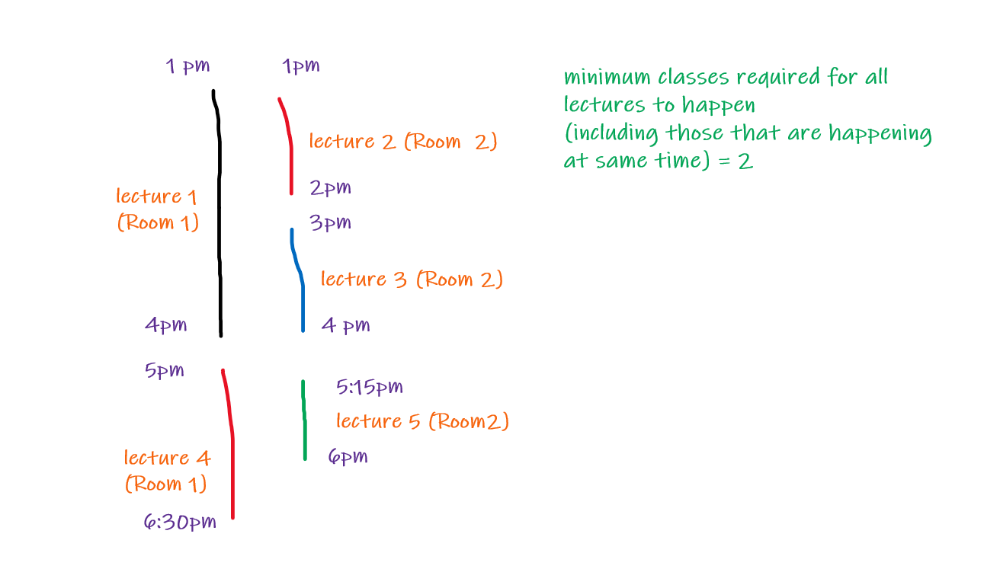
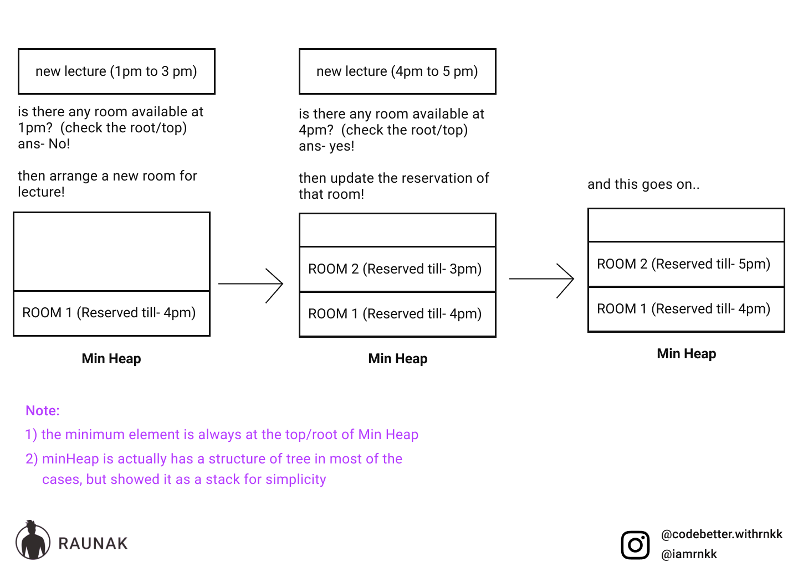

# Day 69- Meeting Rooms II (LeetCode/interviewbit)

the problem statement here is similar to meeting rooms meeting rooms ii of leetcode/interview bit

## Problem statement

**This problem was asked by Snapchat.**

**Given an array of time intervals (start, end) for classroom lectures (possibly overlapping), find the minimum number of rooms required.**

**For example, given [(30, 75), (0, 50), (60, 150)], you should return 2.**

## Visualisation:

## Approach

1. sort the the intervals in ascending order according to their starting time
2. create a min heap that stores the earliest freeable room at the top/root i.e acording to ending time of intervals
3. traverse intervals and check the heap as the below image

## code (Java)

[Click Here](Day69.java)